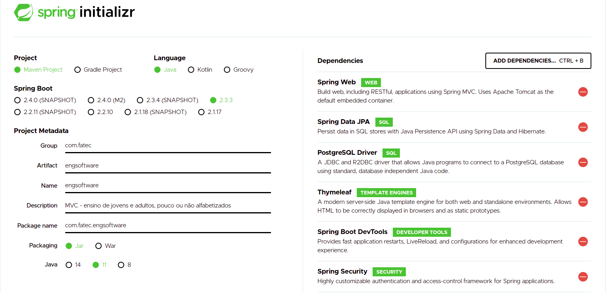

# spring-boot-demo-course

# Configurações do projeto


- Maven Project
- Spring Boot versão 2.3.3
- Java versão 11
- Packaging: Jar


## Dependências
- Spring Web
- Spring Data JPA
- PostgreSQL Driver
- template engine Thymeleaf
- Spring Security
- Spring Boot DevTools (dep de desenvolvimento)

---
## Configurando banco de dados
`É necessário ter o PostgreSQL instalado na sua máquina`

1. Acessando o shell do Postgres  
```shell
sudo - su postgres
psql --cluster 12/main
```

2. Criando o banco  
```shell
CREATE DATABSE fatec;
```

3. Entrando no banco
```shell
\c fatec;
```

4. Em application.properties  
veja no arquivo as configurações para acessar o banco criado
